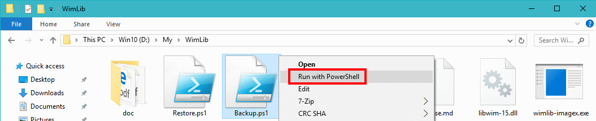
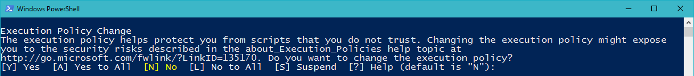

<!--
Original work Copyright (c) 2017 Dr. Frank Heimes (twitter.com/DrFGHde, www.facebook.com/dr.frank.heimes)

Permission is hereby granted, free of charge, to any person obtaining a copy
of this software and associated documentation files (the "Software"), to deal
in the Software without restriction, including without limitation the rights
to use, copy, modify, merge, publish, distribute, sublicense, and/or sell
copies of the Software, and to permit persons to whom the Software is
furnished to do so, subject to the following conditions:

The above copyright notice and this permission notice shall be
included in all copies or substantial portions of the Software.

THE SOFTWARE IS PROVIDED "AS IS", WITHOUT WARRANTY OF ANY KIND, EXPRESS OR
IMPLIED, INCLUDING BUT NOT LIMITED TO THE WARRANTIES OF MERCHANTABILITY,
FITNESS FOR A PARTICULAR PURPOSE AND NON-INFRINGEMENT. IN NO EVENT SHALL THE
AUTHORS OR COPYRIGHT HOLDERS BE LIABLE FOR ANY CLAIM, DAMAGES OR OTHER
LIABILITY, WHETHER IN AN ACTION OF CONTRACT, TORT OR OTHERWISE, ARISING FROM,
OUT OF OR IN CONNECTION WITH THE SOFTWARE OR THE USE OR OTHER DEALINGS IN THE
SOFTWARE.
-->

# WimLibScripts MANUAL

## Prerequisites

1. The scripts have been developed with PowerShell 5.0.  
   I don't know if they work with previous versions of PowerShell.
2. The scripts use the [WimLib](https://wimlib.net) library. Download it from https://wimlib.net .
3. To run the scripts `Backup.ps1` and `Restore.ps1`, you need Administrator privileges.
4. To restore an image to the live Windows system, you need a bootable medium,
   e.g. a Windows volume on a USB drive or an installation CD.
5. Since both, WimLib as well as PowerShell, are available for Linux,
   you might even be able to use Linux to restore a Windows volume.

## Installation

1. Download the [WimLib](https://wimlib.net) library.
2. Unpack it into an arbitrary folder, preferably `C:\My\WimLib`.
3. Download the [WimLibScripts](https://github.com/FrankHeimes/WimLibScripts) repository.
3. Place all PowerShell scripts `*.ps1` into the same folder as `wimlib-imagex.exe` and `libwim-15.dll`.

## How to use

To execute a script, open the context menu for it and select *Run with PowerShell*

This way, you don't need to modify the global ExecutionPolicy of the system.

Upon first invocation, the following security warning may appear:

```
Execution Policy Change
The execution policy helps protect you from scripts that you do not trust. Changing the execution policy might expose
you to the security risks described in the about_Execution_Policies help topic at
http://go.microsoft.com/fwlink/?LinkID=135170. Do you want to change the execution policy?
[Y] Yes  [A] Yes to All  [N] No  [L] No to All  [S] Suspend  [?] Help (default is "N"):
```
To continue the script, answer `Y`.

The scripts `Backup.ps1` and `Restore.ps1` restart itself with Administrator privileges if it is started from a limited account.

All scripts contain a configuration section with default parameters.
You can run the scripts interactively or execute them using the default parameters.

Several consistency and security checks are performed. In case of an error, an exception is thrown.
In interactive mode, the error is reported before aborting the script.
							  
This repository currently contains the following scripts:

---

## Backup.ps1

This script creates a backup from an entire volume and adds that as an image to a WIM file, creating the latter if necessary.
It queries all required parameters and runs the Windows Clean Manager in advance.
It verifies the backup and creates a table of contents for the new image.

### Configuration
The script contains a `--- Configuration ---` section with the following parameters

| Parameter | Default | Explanation
| --------- | ------- | -----------
| `$Global:runInteractive` | `$true` | If `$true`, all parameters can be entered interactively and have to be confirmed. If `$false`, the parameters in this section are used for the backup and all dialogs and queries are skipped.
| `$Global:useFileDialogs` | `$true` | If `$true`, a Windows Forms SaveFileDialog is opened to interactively select the WIM file. If `$false`, the path has to be entered as string.
| `$Global:runCleanMgr` | `$true` | If `$true`, the Windows Clean Manager is called before creating the backup. You can call it once to configure what to delete: `cleanmgr /sageset:1`
| `$Global:copyWIMFile` | `$true` | If `$true`, the WIM file is copied before adding the new image to it. This is a safety precaution to avoid corruption of the WIM file in case of a system crash, hardware failure, or power outage.
| `$Global:volume` | `'C:\'` | The volume to backup. This can and should be the live system, because the clean manager is most effective in this case.
| `$Global:wimFile` | `'M:\Backup\System.wim'` | The target WIM file to add the backup image to. This cannot be the volume to backup and it should not be on the same physical drive.
| `$Global:imageName` | Long date and time | A descriptive name for the new backup image. |

### WARNING
**When setting `$Global:runInteractive` to `$false`, make sure all remaining parameters are correct!**

### Performance
The [WimLib](https://wimlib.net) library is configured to use LZMS compression in parallel on all available cores.
The backup operation processes about 20 GB per hour using four cores of an intel Core i5.

---

## Restore.ps1

This script restores a volume from a backup image in a WIM file. It queries all required parameters and verifies the backup.
Before restoring the data, the volume is quick formatted.

### Configuration
The script contains a `--- Configuration ---` section with the following parameters

| Parameter | Default | Explanation
| --------- | ------- | -----------
| `$Global:runInteractive` | `$true` | If `$true`, all parameters can be entered interactively and have to be confirmed. If `$false`, the parameters in this section are used for the restore and all dialogs and queries are skipped.
| `$Global:useFileDialogs` | `$true` | If `$true`, a Windows Forms OpenFileDialog is opened to interactively select the WIM file. If `$false`, the path has to be entered as string.
| `$Global:volume` | `'G:\'` | The volume to restore. This can *neither* be the live system *nor* the volume holding the WIM file.
| `$Global:wimFile` | `'M:\Backup\System.wim'` | The source WIM file to take the backup image from. This cannot reside on the volume to restore.
| `$Global:imageIndex` | 9999 | The image index in the WIM file to restore. If this number is too high, then the highest available index is picked.

### WARNING
**When setting `$Global:runInteractive` to `$false`, make sure all remaining parameters are correct!
This is particularly important for this restore script.
With the wrong parameters you can easily damage your data or operating system beyond repair!**

### Performance
The restore operation yields about 140 GB per hour on a SSD.

---

## ListImageContents.ps1

This script creates a table of contents for an image in a WIM file into a text file.

### Configuration
The script contains a `--- Configuration ---` section with the following parameters

| Parameter | Default | Explanation
| --------- | ------- | -----------
| `$Global:runInteractive` | `$true` | If `$true`, all parameters can be entered interactively. If `$false`, the parameters in this section are used for the listing and all dialogs and queries are skipped.
| `$Global:useFileDialogs` | `$true` | If `$true`, a Windows Forms OpenFileDialog is opened to interactively select the WIM file. If `$false`, the path has to be entered as string.
| `$Global:wimFile` | `'M:\Backup\System.wim'` | The WIM file to examine.
| `$Global:imageIndex` | 9999 | The image index in the WIM file to examine. If this number is too high, then the highest available index is picked.

---

### Known Issues
The following are merely issues of the [WimLib](https://wimlib.net) library or the
[WIM](https://de.wikipedia.org/wiki/Windows_Imaging_Format_Archive) file format as such,
because the PowerShell scripts do little more but invoke `wimlib-imagex.exe`
- The reported sizes of the images in the WIM file do not reflect the size of the extracted files on the volume;
the Windows `DISM` command reports the same figure.
According to my observation, the reported size is about 30% too large.
This may cause the `Restore.ps1` script to warn about an allegedly insufficiently large volume.
Any hints about how to correctly determine the size of a WIM image are highly welcome. 
- After restoring the backup of a Windows 10 partition of a USB drive to a volume on the internal hard drive,
I noticed that the restored volume consumed about 3% more space.
However, the file list of the original and the restored volumes as well as the cluster sizes were identical.
On the other hand, the reported occupied space of a specific volume varies by several percent depending on whether it's live or passive.
So I don't think this is a real issue.
- The Windows `DISM` command as well as the `Mount-WindowsImage` PowerShell cmdlet are supposedly able to mount a WIM image.
But both report *"Attempted to load a file with a wrong format"* and the `dism.log` reports a *"version/header mismatch"* problem.
- When restoring an image, WimLib typically issues `[WARNING] Ignoring FILE_ATTRIBUTE_SPARSE_FILE of nn files`
for a small number `nn` of files. To my knowledge, this has no negative side effects.

## Tips
#### Browse and Extract
Use the free [7-Zip](http://www.7-zip.org/) archiver to open and browse a WIM file or to extract a limited number of files.
You will probably want to use the `Restore.ps1` script to extract the entire volume as this also recreates all file meta data and permissions.

#### Administer
For administering an image of the WIM file, proceed as follows:
1. Open the Windows Disk Management and create a new virtual disk.
2. Format it as NTFS and assign a drive letter.
3. Restore an image of the WIM file to that disk.
4. Inspect and/or modify its contents.
5. Create a backup of the virtual disk and add it as new image to the WIM file.

Due to the way a WIM file is structured, only your changes may increase its size.
So leaving the old image in the WIM file usually does not waste (much) space.
Of course, if you deleted substantial portions of the volume, you're better off creating a new WIM file.

#### Quick Launch
To allow a PowerShell script to run with a double-click, create a Windows Shortcut with this target (e.g. for `Backup.ps1`):  
  `C:\Windows\System32\WindowsPowerShell\v1.0\powershell.exe –ExecutionPolicy Unrestricted –NoProfile –File C:\My\WimLib\lib\Backup.ps1`

But beware that Windows shortcuts always contain absolute paths!
These may act surprisingly if running this script from the live system or a backup USB system.
